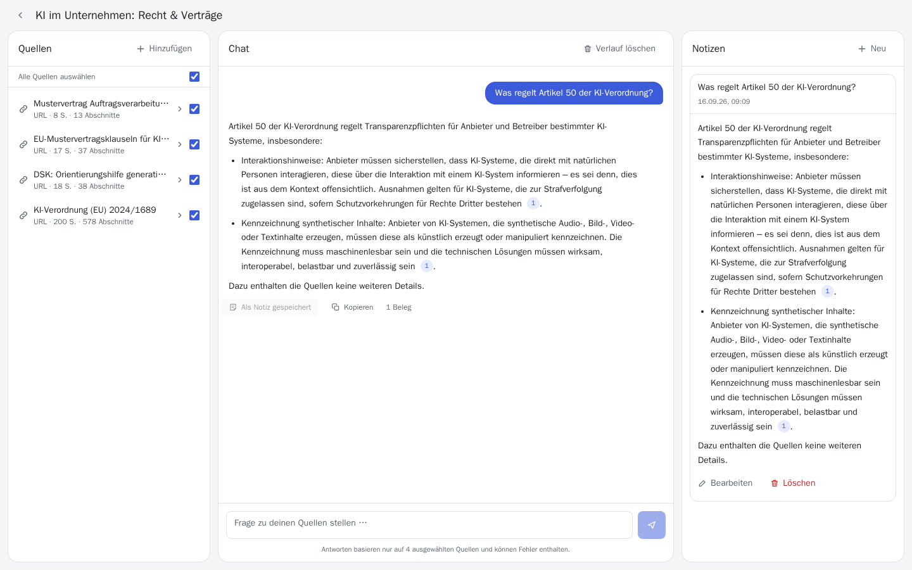
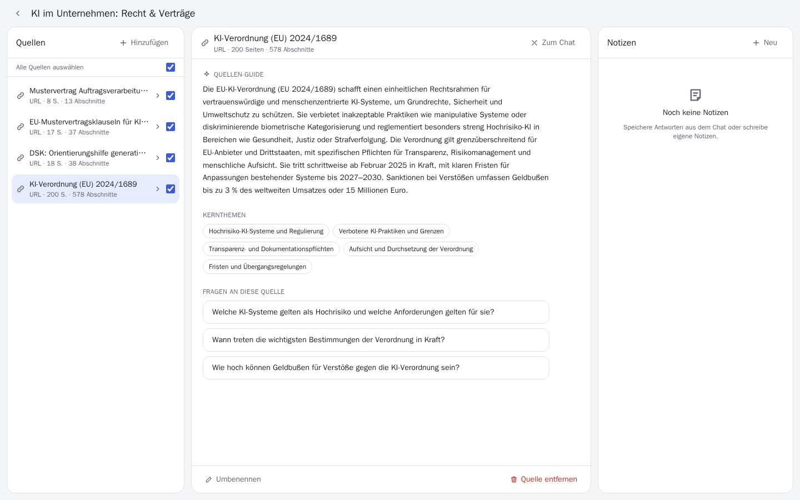
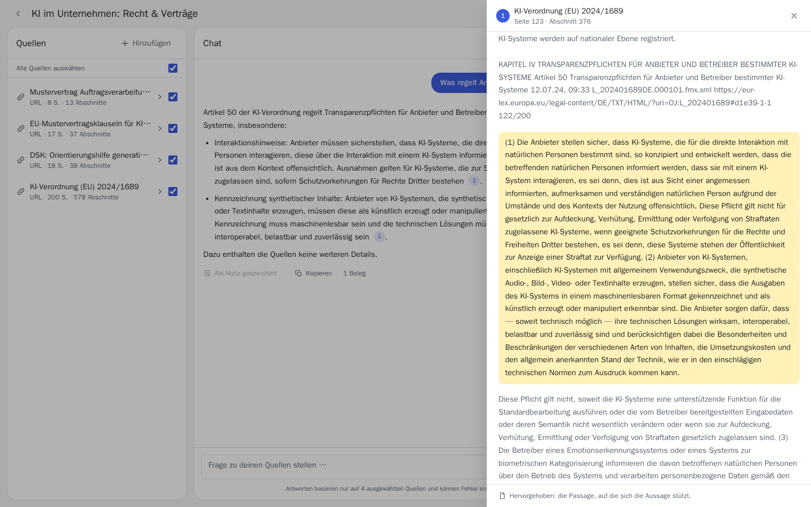
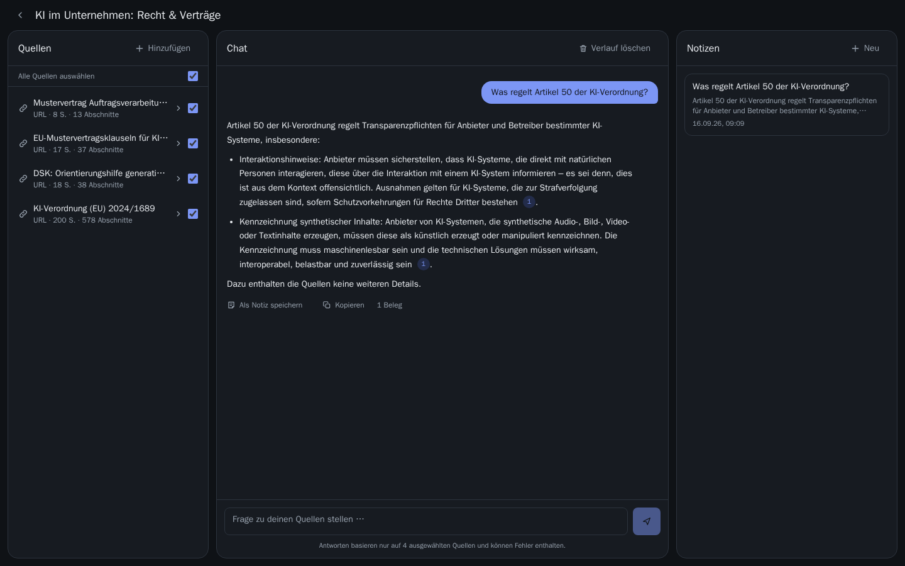
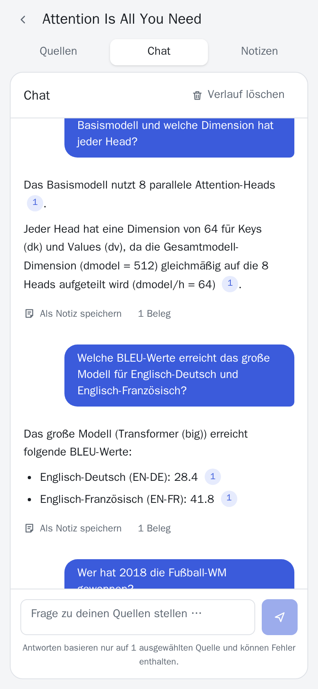

# Notebook – ein NotebookLM-Klon

Quellen hochladen, Fragen stellen, Antworten **ausschließlich aus den Quellen** erhalten – jede
Aussage mit einem klickbaren Beleg, der die Originalpassage öffnet.

**Live: [notebook.jaekel.dev](https://notebook.jaekel.dev)** — der Access-Key steht in der Abgabe-Mail.

[](https://github.com/Karl-Johann-Jaekel/KI-Wissensmanagement-Tool/actions/workflows/ci.yml)

Entstanden als Bewerbungsaufgabe in einer 3-Tage-Zeitbox. Vorgehen und Status: [plan.md](plan.md),
Entscheidungen: [docs/adr/](docs/adr/README.md), Arbeit mit AI-Tools: [docs/prompts.md](docs/prompts.md).



<sub>Echter Durchlauf auf der Live-Instanz mit `ministral-14b-latest` und dem Demo-Notebook
(KI-Verordnung, DSK-Leitlinie, Mustervertragsklauseln, Auftragsverarbeitungsvertrag).
Aufgenommen mit [e2e/screenshots.py](e2e/screenshots.py).</sub>

## Funktionen

| Bereich | Umfang |
|---|---|
| Notebooks | anlegen, umbenennen, löschen |
| Quellen | PDF (mit Textebene), TXT, Markdown, Webseiten-Import; Verarbeitung im Hintergrund mit Statusanzeige |
| Quellen-Guide | automatische Zusammenfassung, Kernthemen und drei Fragevorschläge je Quelle, geöffnet in der Hauptspalte |
| Notebook-Überblick | was die Quellen gemeinsam abdecken, plus Fragen über mehrere Quellen hinweg ([ADR-12](docs/adr/012-notebook-overview.md)) |
| Chat | Antworten nur aus den Quellen, im Schreiben sichtbar (Streaming), Inline-Zitate `[1]`, expliziter Hinweis, wenn die Quellen nichts hergeben; eine Antwort ohne jeden Beleg wird als ungeprüft markiert ([ADR-14](docs/adr/014-prompt-injection.md)) |
| Zitat-Viewer | Vorschau der Passage beim Überfahren eines Zitats, Klick öffnet sie hervorgehoben mit Quelle, Seite und Nachbarabschnitten |
| Quellen-Filter | pro Quelle wählbar, ob sie in Antworten einfließt |
| Studio | was das Notebook aus seinen Quellen erzeugen kann, an einer Stelle: Briefing, FAQ, Themenkarte – darunter die Notizen |
| Berichte | Briefing (Kernfragen des Notebooks) und FAQ (Fragen der Quellen-Guides); beide beantworten ihre Fragen über den normalen Chat-Pfad und landen als belegte Notiz ([ADR-13](docs/adr/013-briefing-document.md)) |
| Themenkarte | die Kernthemen aller Quellen als Karte, gezeichnet aus vorhandenen Daten ohne LLM-Aufruf; ein Klick auf ein Thema fragt den Chat danach |
| Notizen | Antwort als Notiz speichern – die Belege bleiben dort klickbar ([ADR-11](docs/adr/011-note-citations.md)) –, eigene Notizen, bearbeiten, löschen |
| Zugang | ein gemeinsamer Access-Key für die Demo-Instanz |

Bewusst nicht enthalten: Audio und Video Overview, Mind Map, Flashcards und Quiz,
YouTube- und Audio-Quellen, Quellensuche im Web, Multi-User und Teilen.

| Quellen-Guide | Zitat-Viewer |
|---|---|
|  |  |

| Dunkelmodus | Mobil |
|---|---|
|  |  |

## Architektur

```mermaid
flowchart LR
  B[Browser] --> N[nginx<br/>React-Build + /api-Proxy]
  N --> A[FastAPI]
  A --> P[(Postgres 17<br/>pgvector + Volltext)]
  A --> E[fastembed<br/>multilingual-e5-small, CPU]
  A --> L[LLM-Provider<br/>Mistral | Ollama]
```

**Ingestion** (Hintergrundjob): Parsen (pypdf / trafilatura) → Chunking an Absatzgrenzen, nie über
Seitengrenzen → lokale Embeddings → Speichern → Quelle ist chatbar → Quellen-Guide per LLM
(Map-Reduce bei langen Quellen, eigener Status, bei Fehler neu anstoßbar).

**Chat**: Frage einbetten → Top-20 Vektor + Top-20 Volltext, gefiltert auf die gewählten Quellen →
Reciprocal Rank Fusion → Top-8 nummerierte Passagen an das LLM → das Backend validiert jedes `[n]`,
entfernt erfundene Nummern, nummeriert neu und liefert Chunk-IDs für den Zitat-Viewer.

Die Antwort wird als Server-Sent Events ausgeliefert: erst die Zahl der gefundenen Passagen, dann
der Text beim Entstehen, zuletzt die geprüfte Fassung mit klickbaren Belegen ([ADR-10](docs/adr/010-streaming-answers.md)).

| Entscheidung | ADR |
|---|---|
| Hybrid Retrieval statt reiner Vektorsuche | [ADR-04](docs/adr/004-hybrid-retrieval-rrf.md) |
| Zitate als validierte Passagen-Nummern | [ADR-05](docs/adr/005-validated-citations.md) |
| Lokale Embeddings, EU-LLM mit Provider-Switch | [ADR-02](docs/adr/002-local-embeddings.md), [ADR-03](docs/adr/003-llm-provider-mistral.md) |
| Fallback auf zweites Mistral-Modell statt Ollama (mit Messung) | [ADR-09](docs/adr/009-llm-fallback.md) |
| Streaming, ohne die Zitatprüfung aufzuweichen | [ADR-10](docs/adr/010-streaming-answers.md) |
| Belege enden nicht an der Notiz | [ADR-11](docs/adr/011-note-citations.md) |
| Überblick aus den Guides statt aus dem Volltext | [ADR-12](docs/adr/012-notebook-overview.md) |
| Berichte als Kette gewöhnlicher Antworten | [ADR-13](docs/adr/013-briefing-document.md) |

## Retrieval-Qualität

Gemessen mit [backend/scripts/retrieval_eval.py](backend/scripts/retrieval_eval.py) gegen das
Demo-Notebook auf der Live-Instanz: 17 Fragen, deren Antwort nachweislich in den Quellen steht, und
5 Fragen, die die Quellen nicht beantworten. Die erwarteten Seiten wurden in den gespeicherten
Abschnitten nachgeschlagen, nicht geschätzt. Kein LLM-Aufruf – gemessen wird nur, was an das Modell
weitergegeben würde.

| Rangliste | Fragen | hit@8 | MRR@8 |
|---|---|---|---|
| Vektor | 17 | 71 % | 0,53 |
| Volltext | 17 | 59 % | 0,26 |
| Normverweis | 3 | 100 % | 0,47 |
| **RRF, alle drei fusioniert** | 17 | **94 %** | **0,59** |

Die Fusion findet die Antwort in 16 von 17 Fällen unter den ersten acht Passagen; die beste
Einzelliste in 12. Die Normverweis-Liste wird nur an den drei Fragen mit Artikelnummer gemessen, ohne
Verweis liefert sie absichtlich nichts – dort ist sie aber unersetzlich: „Was regelt Artikel 50?"
findet weder die Vektor- noch die Volltextsuche, der Normverweis steht auf Rang 1.

**Die Normverweis-Liste rankt nicht auf jeder Instanz gleich.** Lokal gegen dieselben Quellen
gemessen, steht bei „Was verlangt Artikel 4 zur KI-Kompetenz?" der richtige Abschnitt in dieser Liste
auf Rang 1 statt 4 und nach der Fusion auf Rang 3 statt 6; die MRR der Liste liegt bei 0,72 statt
0,47. hit@8 bleibt in allen Listen gleich. Ursache: Zwei Stellen gelten als definierende Überschrift –
„Artikel 4 KI-Kompetenz" in der KI-Verordnung und „… von Artikel 4 Gebrauch zu machen" in den
Mustervertragsklauseln, denn im Deutschen ist auch ein Substantiv nach der Nummer großgeschrieben.
Gleichrangige Treffer ordnet die Suche nach der ID ihrer Quelle, einer zufälligen UUID. Welche Stelle
vorne steht, entscheidet also der Import. Dieselbe Regel hält auch „Artikel 5 Absätze 2 bis 6" und
„nach Art. 5 DSGVO" für Überschriften. Die Tabelle oben gilt für die Live-Instanz. Nicht behoben: Eine
Sortierung nach Importreihenfolge wäre genauso zufällig, und eine inhaltliche Sortierung verändert das
Ranking und müsste erst neu gemessen werden.

**Der eine Fehlschlag:** „Wie hoch sind die Geldbußen?" Die Beträge für Unternehmen stehen auf S. 168
und 169 der KI-Verordnung; keine Liste bringt sie unter die ersten acht. Gefunden werden ein
Erwägungsgrund zu Sanktionen ohne Beträge und S. 171 mit den Bußgeldern für EU-Organe.

| Vektor-Distanz des besten Treffers | Fragen | min | Median | max |
|---|---|---|---|---|
| beantwortbar | 17 | 0,094 | 0,127 | 0,177 |
| nicht beantwortbar | 5 | 0,185 | 0,205 | 0,267 |

In dieser Stichprobe trennt die Distanz beide Gruppen, aber mit 0,008 Abstand und nur fünf
unbeantwortbaren Fragen. Das reicht nicht für eine feste Schwelle, ab der das Backend selbst „nicht in
den Quellen" antwortet – diese Entscheidung bleibt beim Modell, und die Zitatprüfung
([ADR-05](docs/adr/005-validated-citations.md), [ADR-14](docs/adr/014-prompt-injection.md)) fängt
Antworten ohne Beleg ab.

<details>
<summary>Alle 22 Fragen mit Rang je Liste</summary>

| Frage | Vektor | Volltext | Normverweis | RRF | Distanz |
|---|---|---|---|---|---|
| Was regelt Artikel 50 der KI-Verordnung? | ✗ | ✗ | 1 | 2 | 0,120 |
| Welche Praktiken verbietet Artikel 5 der KI-Verordnung? | 1 | ✗ | 6 | 1 | 0,123 |
| Was verlangt Artikel 4 zur KI-Kompetenz? | ✗ | ✗ | 4 | 6 | 0,111 |
| Welche KI-Praktiken sind verboten? | 2 | 4 | · | 1 | 0,121 |
| Nach welchen Regeln wird ein KI-System als hochriskant eingestuft? | 4 | 4 | · | 1 | 0,094 |
| Welche Aufzeichnungspflichten gelten für Hochrisiko-KI-Systeme? | 2 | ✗ | · | 5 | 0,102 |
| Wie hoch sind die Geldbußen bei Verstößen gegen die KI-Verordnung? | ✗ | ✗ | · | ✗ | 0,136 |
| Ab wann gilt die KI-Verordnung? | 1 | ✗ | · | 3 | 0,094 |
| Welche technisch-organisatorischen Maßnahmen sieht der Mustervertrag vor? | ✗ | 4 | · | 8 | 0,167 |
| Was muss der Auftragsverarbeiter tun, bevor er einen weiteren Auftragsverarbeiter einsetzt? | 1 | 1 | · | 1 | 0,133 |
| Wie lange läuft die Vereinbarung zur Auftragsverarbeitung? | 1 | 2 | · | 1 | 0,140 |
| Was gilt für Verarbeitungen in Drittstaaten? | 1 | ✗ | · | 1 | 0,133 |
| Was versteht die DSK unter Halluzinationen? | 1 | 1 | · | 1 | 0,177 |
| Wie werden personenbezogene Daten in einem RAG-System gelöscht? | 3 | 5 | · | 2 | 0,127 |
| Aus welchen Komponenten besteht ein RAG-System? | 2 | 3 | · | 2 | 0,131 |
| Welche Rechte an Datensätzen regeln die Mustervertragsklauseln? | ✗ | 2 | · | 4 | 0,132 |
| Welches Auditrecht haben öffentliche Einrichtungen nach den MVK-KI? | 1 | 8 | · | 2 | 0,111 |
| Wie hoch ist der gesetzliche Mindestlohn in Deutschland? | – | – | – | – | 0,203 |
| Wer hat die Fußball-Weltmeisterschaft 2014 gewonnen? | – | – | – | – | 0,267 |
| Welche Wirkstoffe enthält Ibuprofen? | – | – | – | – | 0,205 |
| Wie funktioniert die Photosynthese bei Pflanzen? | – | – | – | – | 0,222 |
| Wie hoch ist die Einkommensteuer für Selbstständige? | – | – | – | – | 0,185 |

✗ = nicht unter den ersten acht, · = keine Artikelnummer in der Frage

</details>

## Lokal starten

Voraussetzung: Docker mit Compose.

```bash
cp .env.example .env          # ACCESS_KEY, POSTGRES_PASSWORD und MISTRAL_API_KEY setzen
docker compose up -d --build  # erster Build lädt das Embedding-Modell (~470 MB)
open http://localhost:8080    # Windows: start http://localhost:8080
```

Das Frontend fragt nach dem `ACCESS_KEY` aus der `.env`. Ohne gültigen Mistral-Key funktionieren
Upload, Suche und Zitat-Viewer; Guide und Chat melden den Fehler sichtbar.

Demo-Notebook „KI im Unternehmen: Recht & Verträge“ (KI-Verordnung, DSK-Leitlinie zu RAG,
KI-Vertragsklauseln, Mustervertrag) anlegen und geprüfte Demo-Fragen: [demo/README.md](demo/README.md).

Frontend-Entwicklung mit Hot-Reload: `cd frontend && npm install && npm run dev` (Vite auf
Port 5173, `/api` wird an `BACKEND_PORT` weitergeleitet).

## Konfiguration

Alle Werte in [.env.example](.env.example). Die wichtigsten:

| Variable | Zweck |
|---|---|
| `ACCESS_KEY` | gemeinsamer Zugangsschlüssel, mindestens 12 Zeichen |
| `LLM_PROVIDER` | `mistral` (Standard) oder `ollama` |
| `MISTRAL_API_KEY`, `MISTRAL_MODEL` | La Plateforme, Standard `ministral-14b-latest` (Free-Tier-Kontingent ist pro Modell, siehe ADR-03) |
| `MISTRAL_FALLBACK_MODEL` | springt ein, wenn das Hauptmodell limitiert ist; Standard `ministral-8b-latest`, leer = aus ([ADR-09](docs/adr/009-llm-fallback.md)) |
| `FRONTEND_PORT` | Host-Port des Frontends, nur an `127.0.0.1` gebunden |
| `CHUNK_MAX_CHARS`, `RETRIEVAL_TOP_K` | Chunk-Größe und Anzahl Passagen pro Antwort |
| `INGEST_CONCURRENCY` | wie viele Uploads gleichzeitig verarbeitet werden; Standard 1, weil ein großes PDF allein fast 2 GiB belegt |

## Produktiv-Deployment

Die Live-Instanz läuft auf einem eigenen VPS hinter einem gemeinsamen Caddy, der TLS für alle
Hosts der Maschine übernimmt ([ADR-06](docs/adr/006-deployment-vps.md)). Produktiv läuft derselbe
Stack wie lokal, nur ohne die Entwicklungs-Override-Datei:

```bash
docker compose -f docker-compose.yml -f docker-compose.mainserver.yml up -d --build
```

Die Overlay-Datei `docker-compose.mainserver.yml` liegt auf dem Server, nicht im Repo — ein
frischer Klon soll eigenständig lauffähig bleiben. Sie nimmt dem Frontend die Host-Bindung
(`ports: !reset []`) und hängt es ins externe Docker-Netz `web`, in dem auch Caddy liegt; der
Inhalt steht in ADR-06. Produktiv hat damit kein Container einen Host-Port: Backend und Postgres
sind nur im Compose-Netz erreichbar, das Frontend nur für Caddy.

## Tests

```bash
docker compose exec backend pytest                      # Fake-LLM + Fake-Embedder, eigene Test-DB
docker compose exec backend ruff check . && docker compose exec backend mypy app
cd frontend && npm run build && npm run lint
```

Dieselben Prüfungen laufen bei jedem Push und jedem Pull Request in
[GitHub Actions](.github/workflows/ci.yml) — Backend gegen einen echten Postgres mit pgvector,
Frontend als Build und Lint. Nur der Browser-E2E bleibt lokal: er baut den kompletten Stack
inklusive des 470 MB großen Embedding-Modells.

### Browser-E2E

Klickt den Kern-Workflow in 23 Schritten im echten Browser durch – Upload, Guide, Überblick,
Frage mit Beleg, Zitat-Viewer, Absage außerhalb der Quellen, Markierung einer Antwort ohne Beleg,
Notiz, Themenkarte, Briefing, FAQ, Quellenfilter, SSRF-Block, Dunkelmodus, Mobil-Layout – und
schlägt bei jeder Console-Warnung und jedem nativen Browserdialog fehl. Ein Mock-LLM spricht die
Mistral-API, es wird kein Kontingent verbraucht.

```bash
docker compose -f docker-compose.yml -f docker-compose.override.yml -f e2e/docker-compose.e2e.yml up -d --build
docker compose -f docker-compose.yml -f docker-compose.override.yml -f e2e/docker-compose.e2e.yml run --rm e2e
docker compose up -d --remove-orphans   # danach zurück zur normalen Konfiguration
```

Beim ersten Lauf wird das Transformer-Paper (arXiv 1706.03762) als Test-PDF geladen; Screenshots
liegen anschließend in `e2e/out/`. Mit `E2E_IMPORT_URL=https://…` wird zusätzlich der URL-Import
getestet.

Die Screenshots in diesem README erzeugt [e2e/screenshots.py](e2e/screenshots.py) gegen eine
laufende Instanz — Chat und Notizen des Ziel-Notebooks werden davor und danach geleert, die
Bilder sind also wiederholbar.

### Prüfungen gegen das echte Modell

Zwei Skripte laufen bewusst außerhalb von `pytest`, weil sie echte Daten oder das echte Modell
brauchen:

| Skript | Prüft |
|---|---|
| [backend/scripts/retrieval_eval.py](backend/scripts/retrieval_eval.py) | Rangqualität je Suchliste gegen das Demo-Notebook, ohne LLM-Aufruf ([Retrieval-Qualität](#retrieval-qualität)) |
| [backend/scripts/prompt_injection_check.py](backend/scripts/prompt_injection_check.py) | ob eine Quelle mit eingeschleuster Anweisung den Leser täuschen kann ([ADR-14](docs/adr/014-prompt-injection.md)) |

## Projektstruktur

```
backend/app/
  ingest/      parsers.py, url.py (SSRF-Schutz), chunker.py, guide.py, overview.py, pipeline.py
  retrieval/   embed.py, text_query.py, search.py, rrf.py
  llm/         provider.py (Mistral | Ollama, Retry, Streaming), prompts.py
  routers/     notebooks, sources, chat (inkl. SSE), notes (inkl. Berichte)
  citations.py Parsing und Validierung der [n]-Marker, Prüfung auf fehlende Belege
  reports.py   Briefing und FAQ als Kette belegter Antworten
backend/scripts/  Retrieval-Evaluation, Prompt-Injection-Prüfung (gegen echte Daten)
frontend/src/  App.tsx, api.ts, components/ (SourcePanel, SourceGuidePanel, ChatPanel,
               StudioPanel, TopicMapPanel, CitationDrawer, Dialogs, …)
e2e/           Playwright-Test, Mock-LLM, Screenshot-Skript
demo/          Seed-Skript und Demo-Fragen
docs/adr/      Architekturentscheidungen
```
